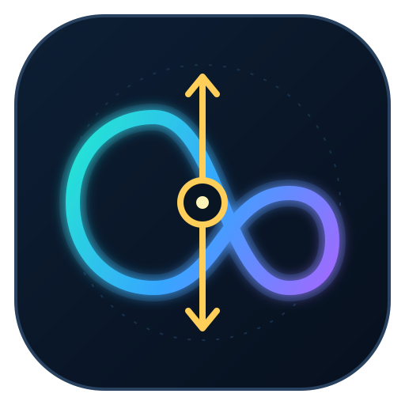
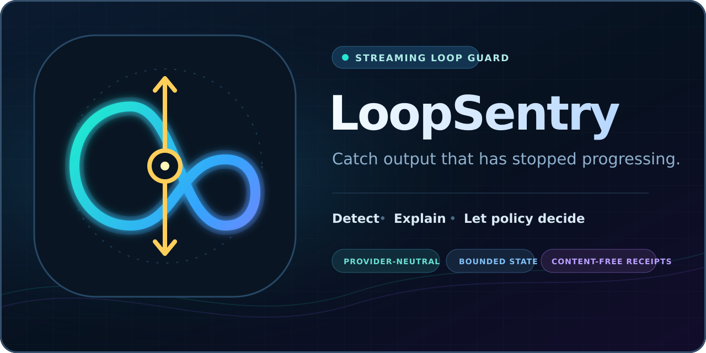

<p align="center">
  
</p>

<h1 align="center">LoopSentry</h1>

<p align="center"><strong>Catch output that has stopped progressing—before the token budget notices.</strong></p>

<p align="center">
  <a href="https://github.com/Dean00dev/LoopSentry/actions/workflows/ci.yml"></a>
  
  
  <a href="LICENSE"></a>
  
</p>

LoopSentry is a provider-neutral streaming detector for exact repetitive cycles in model and agent output. It watches tokens, words, characters, lines, or normalized tool events; keeps bounded state; and emits content-free evidence so the caller—not the detector—decides what to do.

> [!IMPORTANT]
> **Status: early research alpha.** `v0.2.0-alpha.1` is suitable for evaluation, instrumentation, and policy prototyping. It is not a standalone safety boundary, and automatic termination should use a separately configured escalation threshold plus application-specific review.



## Why another repetition detector?

Inference engines already expose useful controls. For example, [vLLM includes repeated n-gram termination](https://docs.vllm.ai/en/latest/api/vllm/sampling_params/), while [Transformers provides repetition processors and custom stopping criteria](https://huggingface.co/docs/transformers/main_classes/text_generation). LoopSentry occupies a different boundary:

- **outside the engine:** observe hosted-provider output or any iterable stream;
- **beyond tokens:** normalize agent and tool events into equality-stable keys;
- **evidence before enforcement:** distinguish an advisory flag from termination eligibility;
- **privacy-conscious receipts:** report spans and counts without copying observed content;
- **evaluation first:** bind claims to a versioned pathological, benign, and ambiguous corpus.

LoopSentry complements engine-native controls; it does not replace them.

## Quickstart

Install the public alpha directly from its immutable release tag:

```bash
python -m pip install "loopsentry @ git+https://github.com/Dean00dev/LoopSentry.git@v0.2.0-alpha.1"
```

Configure two thresholds so observation and enforcement remain separate:

```python
from loopsentry import LoopSentry, Outcome

guard = LoopSentry(
    min_repeats=4,  # emit an advisory FLAG
    terminate_repeats=8,  # become eligible for caller policy
    max_period=16,
    max_window=512,
    min_observed_units=32,
)

for token_id in model_stream:
    finding = guard.push(token_id)

    if finding is None:
        continue
    if finding.outcome is Outcome.FLAG:
        record_warning(finding.as_dict())
    elif finding.outcome is Outcome.TERMINATE_ELIGIBLE:
        # LoopSentry never closes the stream itself.
        apply_your_policy(finding.as_dict())
```

A receipt describes the observation but contains none of the source units:

```json
{
  "outcome": "terminate_eligible",
  "reason": "exact_periodic_loop",
  "period": 2,
  "repeats": 8,
  "observed_units": 40,
  "matched_units": 16,
  "start_unit": 24,
  "end_unit": 40,
  "window_limited": false
}
```

`start_unit` is zero-based and inclusive; `end_unit` is exclusive. If `window_limited` is true, the reported repeat count is a lower bound because earlier evidence has left the bounded window.

## Watch structured agent events

The optional `key` function normalizes mutable events *before* they enter detector state. Keep only the fields that represent meaningful progress:

```python
guard = LoopSentry(
    min_repeats=3,
    terminate_repeats=6,
    max_period=4,
    max_window=64,
    min_observed_units=6,
    key=lambda event: (
        event["kind"],
        event.get("tool"),
        event.get("status"),
    ),
)

for event in agent_events:
    finding = guard.push(event)
```

The normalizer is part of the policy. Removing arguments may reveal retry loops while also collapsing legitimately distinct work; retaining sensitive arguments puts those values into the in-memory window. Choose deliberately.

## Command line

Scan characters, words, lines, or canonicalized JSONL from a file or standard input:

```bash
loopsentry scan trace.jsonl \
  --unit jsonl \
  --min-repeats 4 \
  --terminate-repeats 8 \
  --stop-on terminate_eligible \
  --pretty
```

| Exit | Meaning |
|---:|---|
| `0` | No requested outcome observed |
| `10` | Advisory flag observed |
| `20` | Termination-eligible cycle observed |
| `2` | Invalid configuration or input |

CLI output is a JSON receipt and never includes scanned content. JSONL mode does canonicalize each parsed object to compare it, so those canonical strings exist transiently and in the bounded in-memory window.

## Evaluation receipt

The committed `v0.2.0` synthetic corpus is SHA-256 bound in `eval/corpus/MANIFEST.json` and separates deliberately ambiguous repetition from labelled false positives.

| Corpus class | Cases | Result at committed defaults |
|---|---:|---:|
| Pathological | 12 | 12 detected |
| Benign | 16 | 0 flagged |
| Ambiguous | 4 | 4 flagged and reported separately |

Pathological detection latency in this corpus is 32 units median and 128 units maximum. These are results on 32 synthetic fixtures—not estimates of real-world sensitivity or false-positive rates.

Reproduce the labelled results and write a machine-readable receipt:

```bash
python -m pip install -e ".[dev]"
python eval/run.py \
  --json-output reports/evaluation-v0.2.0.json \
  --fail-on-mismatch
```

Timing is recorded for diagnostics but is deliberately **not** a CI pass/fail gate. See the [evaluation protocol](docs/EVALUATION.md) and [verification receipt](docs/VERIFICATION_RECEIPT.md).

## Detector contract

The first detector is intentionally narrow: it identifies an exact periodic suffix with a fundamental period no greater than `max_period` and at least `min_repeats` complete repeats.

- State is bounded by `max_window`; memory is `O(max_window)`.
- Work per pushed unit is bounded by configured period and window limits.
- Equality is defined by the unit itself or the configured `key` result.
- The shortest matching period wins.
- `reset()` makes one configured guard safely reusable for a new stream.
- Unhashable normalized units are rejected before state advances.

See [design and invariants](docs/DESIGN.md) for the exact algorithmic boundary.

## Explicit non-claims

LoopSentry does **not** claim to:

- determine whether output is correct, useful, safe, or memorized;
- prevent training-data extraction or remove data from model weights;
- detect semantic loops whose units continue changing;
- infer intent from repeated tool calls;
- guarantee that its default thresholds fit a particular application;
- establish a real-world false-positive rate from its synthetic corpus;
- terminate, cancel, or close a model or agent stream by itself.

An attacker or faulty component that controls event normalization may evade or manufacture equality. Treat receipts as local detector observations, not cryptographic attestations. Read the [threat model](docs/THREAT_MODEL.md) before enforcement.

## Project map

- [`src/loopsentry/core.py`](src/loopsentry/core.py) — bounded detector and receipt model
- [`src/loopsentry/cli.py`](src/loopsentry/cli.py) — standard-library CLI
- [`eval/corpus/v0.2.0.jsonl`](eval/corpus/v0.2.0.jsonl) — versioned synthetic corpus
- [`eval/run.py`](eval/run.py) — validation, metrics, and informational benchmark
- [`docs/INTEGRATIONS.md`](docs/INTEGRATIONS.md) — model and agent integration patterns
- [`docs/VERIFICATION_RECEIPT.md`](docs/VERIFICATION_RECEIPT.md) — what was and was not demonstrated

## Development

```bash
python -m pip install -e ".[dev]"
ruff check .
ruff format --check .
python -m unittest discover -s tests -v
python eval/run.py --fail-on-mismatch
python -m build
```

Please read [CONTRIBUTING.md](CONTRIBUTING.md), report vulnerabilities through [GitHub private vulnerability reporting](SECURITY.md), and keep research fixtures synthetic or explicitly authorized.

## License

Apache-2.0. See [LICENSE](LICENSE) and [NOTICE](NOTICE).
